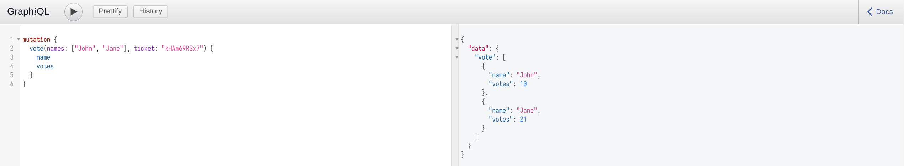

# Tiny Vote

Tiny Vote 是一个使用 GraphQL 设计的简单投票系统，用户可以通过接口为指定的用户名投票，同时也可以查询指定用户名的当前票数。每个投票请求都需要有效的票据 (ticket) 验证，确保投票的安全性与可靠性。

## 架构


## 设计概述
GraphQL：提供灵活、高效的数据查询与变更接口，实现统一的 API 查询层，支持客户端根据需求自定义请求数据，避免冗余数据传输。

Redis 缓存：用于加速数据访问，缓存高频查询数据，减少数据库压力，提升系统响应速度。

MySQL 数据库：作为核心数据的持久化存储，确保数据的可靠性和一致性。

安全性与扩展性：
- 安全设计：通过 ticket 验证，确保数据访问的安全性。
- 优雅关停：支持服务的平滑关闭，避免强制终止带来的数据丢失或请求中断。
- 架构扩展性：模块化设计方便未来集成其他服务，实现服务的横向扩展与功能拓展。

## 构建

首先构建 MySQL、Redis 组件
```sh
docker-compose up -d
```

根据自己的需要(包括数据库配置)修改 [conf.yml](conf.yml) 文件
```yml
server:
  listenOn: 8088 # 服务监听端口
  interval: 2 # 生成 ticket 时间间隔
  maxTicketUsage: 10 # 每个 ticket 的最大使用次数
```

### 数据库表配置
默认情况下 MySQL 为空，可以使用下面命令进入 MySQL 中添加表
```sh
docker exec -it tiny-vote-mysql mysql -u root -p # 密码在 docker-compose.yml 中，默认为 vote
```
进入 MySQL 后，执行 [ticket.sql](./core/dao/mysqlx/sql/ticket.sql)、[user.sql](./core/dao/mysqlx/sql/user.sql)

最后运行 Server 服务
```sh
go run ./main.go
```

## 测试

启动 Server 服务后，可以访问 http://localhost:8088/graphql 来访问 GraphQL server

为了方便测试，可以将 ticket 的有效时间 [interval](conf.yml) 修改为一个较大值(50)

### cas
获得当前有效选票
```graphql
{
  cas
}
```


### query
获取 John 的选票
```graphql
{
  query(name: "John") {
    name
    votes
  }
}
```


### vote
通过获取的票对 John、Jane 进行投票
```graphql
mutation {
  vote(names: ["John", "Jane"], ticket: "kHAm69RSx7") {
    name
    votes
  }
}
```


## LICENSE
本项目所有代码使用 Apache 2.0 进行许可。
